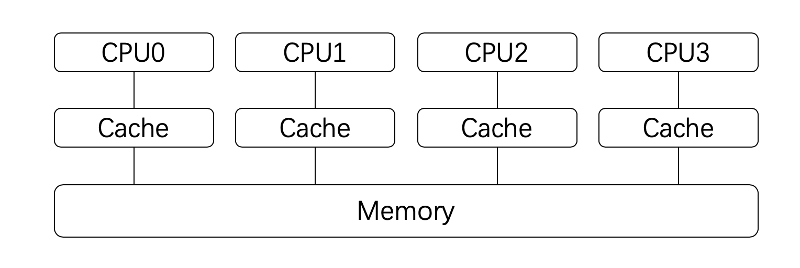
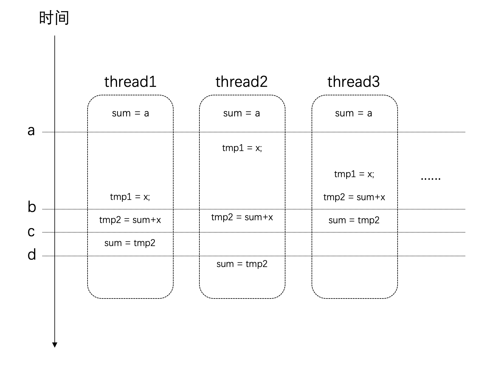
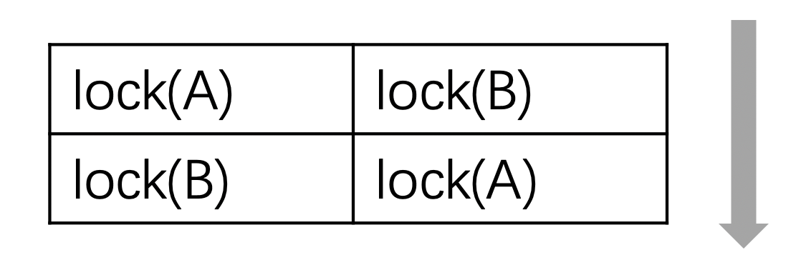
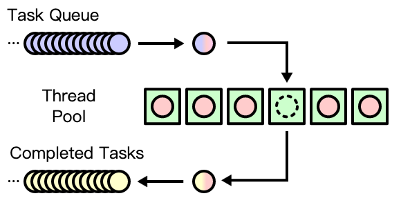

<a name="index">**Index**</a>
<a href="#0">C++多线程</a>  
&emsp;<a href="#1">线程</a>  
&emsp;&emsp;<a href="#2">线程的创建</a>  
&emsp;&emsp;<a href="#3">在线程中传递函数</a>  
&emsp;&emsp;<a href="#4">Join和Detach</a>  
&emsp;&emsp;<a href="#5">管理当前的线程</a>  
&emsp;&emsp;<a href="#6">一次调用</a>  
&emsp;<a href="#7">并发任务</a>  
&emsp;&emsp;<a href="#8">如何写一个并发的程序</a>  
&emsp;&emsp;<a href="#9">竞争条件与临界区</a>  
&emsp;<a href="#10">互斥体与锁</a>  
&emsp;&emsp;<a href="#11">mutex</a>  
&emsp;&emsp;<a href="#12">死锁</a>  
&emsp;&emsp;<a href="#13">通用锁定算法</a>  
&emsp;&emsp;<a href="#14">通用互斥管理</a>  
&emsp;&emsp;&emsp;<a href="#15">RAII</a>  
&emsp;&emsp;<a href="#16">条件变量</a>  
&emsp;<a href="#17">future</a>  
&emsp;&emsp;<a href="#18">async</a>  
&emsp;&emsp;<a href="#19">packaged_task</a>  
&emsp;&emsp;<a href="#20">Promise与future</a>  
&emsp;<a href="#21">并行算法</a>  
<a href="#22">结束语</a>  
<a href="#23">参考资料与推荐读物</a>  
&emsp;<a href="#24">原文地址</a>  
# <a name="0">C++多线程</a><a style="float:right;text-decoration:none;" href="#index">[Top]</a>

## <a name="1">线程</a><a style="float:right;text-decoration:none;" href="#index">[Top]</a>

### <a name="2">线程的创建</a><a style="float:right;text-decoration:none;" href="#index">[Top]</a>

[代码（使用函数）](https://github.com/ldylab/cpp-concurrency/blob/master/src/01_hello_thread.cpp)

[代码（使用lambda表达式）](https://github.com/ldylab/cpp-concurrency/blob/master/src/02_lambda_thread.cpp)

### <a name="3">在线程中传递函数</a><a style="float:right;text-decoration:none;" href="#index">[Top]</a>

[代码（传递一个参数）](https://github.com/ldylab/cpp-concurrency/blob/master/src/03_thread_argument.cpp)

注意：参数是以拷贝的形式进行传递的。因此对于拷贝耗时的对象你可能需要传递指针或者引用类型作为参数。但是，如果是传递指针或者引用，你还需要考虑参数对象的生命周期。因为线程的运行长度很可能会超过参数的生命周期（见下文`detach`），这个时候如果线程还在访问一个已经被销毁的对象就会出现问题。

### <a name="4">Join和Detach</a><a style="float:right;text-decoration:none;" href="#index">[Top]</a>

|**API**|**说明**|
|---|---|
|`join`|等待线程完成执行|
|`detach`|允许线程独立执行|


一旦启动线程之后，必须要决定是等待直到它结束（通过`join`），还是让它独立运行（通过detach），我们必须二者选其一。如果在thread对象销毁的时候我们还没有做出决定，则在thread对象在析构函数出将调用`std:: terminate()`从而导致我们的进程异常退出。

需要注意的是：在我们做决定的时候，很可能线程已经执行完了（例如上面的示例中线程的逻辑仅仅是一句打印，执行时间会很短）。新的线程创建之后，究竟是新的线程先执行，还是当前线程的下一条语句先执行这是不确定的，因为这是由操作系统的调度策略决定的。不过这不要紧，我们只要在`thread`对象销毁前做决定即可。

- `join`：调用此接口时，当前线程会一直阻塞，直到目标线程执行完成（当然，很可能目标线程在此处调用之前就已经执行完成了，不过这不要紧）。因此，如果目标线程的任务非常耗时，你就要考虑好是否需要在主线程上等待它了，因此这很可能会导致主线程卡住。
- `detach`：`detach`是让目标线程成为守护线程（daemon threads）。一旦`detach`之后，目标线程将独立执行，即便其对应的`thread`对象销毁也不影响线程的执行。并且，你无法再与之通信。

对于这两个接口，都必须是可执行的线程才有意义。你可以通过`joinable()`接口查询是否可以对它们进行`join`或者`detach`。

**来自CSDN的一个解释：**

当`thread::join()`函数被调用后，调用它的线程会被block，直到线程的执行被完成。基本上，这是一种可以用来知道一个线程已结束的机制。当`thread::join()`返回时，OS的执行的线程已经完成，C++线程对象可以被销毁。

当`thread::detach()`函数被调用后，执行的线程从线程对象中被分离，已不再被一个线程对象所表达--这是两个独立的事情。C++线程对象可以被销毁，同时OS执行的线程可以继续。如果程序想要知道执行的线程何时结束，就需要一些其它的机制。`join()`函数在那个thread对象上不能再被调用，因为它已经不再和一个执行的线程相关联。

### <a name="5">管理当前的线程</a><a style="float:right;text-decoration:none;" href="#index">[Top]</a>

|**API**|**C++标准**|**说明**|
|---|---|---|
|`yield`|C++11|让出处理器，重新调度各执行线程|
|`get_id`|C++11|返回当前线程的线程ID|
|`sleep_for`|C++11|使当前线程的执行停止指定的时间段|
|`sleep_until`|C++11|使当前线程的执行停止直到指定的时间点|


上面是一些在线程内部使用的API，它们用来对当前线程做一些控制。

- `yield` 通常用在自己的主要任务已经完成的时候，此时希望让出处理器给其他任务使用。
- `get_id` 返回当前线程的id，可以以此来标识不同的线程。
- `sleep_for` 是让当前线程停止一段时间。
- `sleep_until` 和`sleep_for`类似，但是是以具体的时间点为参数。这两个API都以[chrono](https://en.cppreference.com/w/cpp/header/chrono) API（由于篇幅所限，这里不展开这方面内容）为基础。

[代码（系统时间的获得、如何在Thread中使用“delay”、实际使用join和detach）](https://github.com/ldylab/cpp-concurrency/blob/master/src/04_thread_self_manage.cpp)

### <a name="6">一次调用</a><a style="float:right;text-decoration:none;" href="#index">[Top]</a>

|API|C++标准|说明|
|---|---|---|
|`call_once`|C++11|即便在多线程环境下，也能保证只调用某个函数一次|
|`once_flag`|C++11|与`call_once`配合使用|


在一些情况下，我们有些任务需要执行一次，并且我们只希望它执行一次，例如资源的初始化任务。这个时候就可以用到上面的接口。这个接口会保证，**即便在多线程的环境下，相应的函数也只会调用一次。**

我们无法确定具体是哪一个线程会执行`init`。而事实上，我们也不关心，因为只要有某个线程完成这个初始化工作就可以了。

[代码（初始化只执行一次）](https://github.com/ldylab/cpp-concurrency/blob/master/src/05_call_once.cpp)

## <a name="7">并发任务</a><a style="float:right;text-decoration:none;" href="#index">[Top]</a>

### <a name="8">如何写一个并发的程序</a><a style="float:right;text-decoration:none;" href="#index">[Top]</a>

🌰：现在假设我们需要计算某个范围内所有自然数的平方根之和，例如`[1, 10e8]`。

[代码（单线程计算+多线程计算）](https://github.com/ldylab/cpp-concurrency/blob/master/src/06_naive_multithread.cpp)

**出现了问题！**

我们会发现这里的性能并没有明显的提升。更严重的是，这里的结果是错误的。

要搞清楚为什么结果不正确我们需要更多的背景知识。

我们知道，对于现代的处理器来说，为了加速处理的速度，每个处理器都会有自己的高速缓存（Cache），这个高速缓存是与每个处理器相对应的，如下图所示：



处理器在进行计算的时候，高速缓存会参与其中，例如数据的读和写。而高速缓存和系统主存（Memory）是有可能存在不一致的。即：某个结果计算后保存在处理器的高速缓存中了，但是没有同步到主存中，此时这个值对于其他处理器就是不可见的。

事情还远不止这么简单。我们对于全局变量值的修改：`sum += sqrt(i);`这条语句，它并非是原子的。它其实是很多条指令的组合才能完成。假设在某个设备上，这条语句通过下面这几个步骤来完成。它们的时序可能如下所示：



在时间点a的时候，所有线程对于`sum`变量的值是一致的。

但是在时间点b之后，thread3上已经对`sum`进行了赋值。而这个时候其他几个线程也同时在其他处理器上使用了这个值，那么这个时候它们所使用的值就是旧的（错误的）。最后得到的结果也自然是错的。

### <a name="9">竞争条件与临界区</a><a style="float:right;text-decoration:none;" href="#index">[Top]</a>

当多个进程或者线程同时访问共享数据时，只要有一个任务会修改数据，那么就可能会发生问题。此时结果依赖于这些任务执行的相对时间，这种场景称为**[竞争条件](https://en.wikipedia.org/wiki/Race_condition)**[（race condition）](https://en.wikipedia.org/wiki/Race_condition)。

访问共享数据的代码片段称之为**临界区**（critical section）。具体到上面这个示例，临界区就是读写`sum`变量的地方。

要避免竞争条件，就需要对临界区进行数据保护。

很自然的，现在我们能够理解发生竞争条件是因为这些线程在同时访问共享数据，其中有些线程的改动没有让其他线程知道，导致其他线程在错误的基础上进行处理，结果自然也就是错误的。

那么，如果一次只让一个线程访问共享数据，访问完了再让其他线程接着访问，这样就可以避免问题的发生了。

接下来介绍的API提供的就是这样的功能。

## <a name="10">互斥体与锁</a><a style="float:right;text-decoration:none;" href="#index">[Top]</a>

### <a name="11">mutex</a><a style="float:right;text-decoration:none;" href="#index">[Top]</a>

**为什么需要锁？**

开发并发系统的目的主要是为了提升性能：将任务分散到多个线程，然后在不同的处理器上同时执行。这些分散开来的线程通常会包含两类任务：

1. 独立的对于划分给自己的数据的处理
2. 对于处理结果的汇总

其中第1项任务因为每个线程是独立的，不存在竞争条件的问题。而第2项任务，由于所有线程都可能往总结果（例如上面的`sum`变量）汇总，这就需要做保护了。在某一个具体的时刻，只应当有一个线程更新总结果，即：保证每个线程对于共享数据的访问是“互斥”的。`mutex` 就提供了这样的功能。

其中`mutex`是mutual exclusion（互斥）的简写。

- 主要API

|API|C++标准|说明|
|---|---|---|
|`mutex`|C++11|提供基本互斥设施|
|`timed_mutex`|C++11|提供互斥设施，带有超时功能|
|`recursive_mutex`|C++11|提供能被同一线程递归锁定的互斥设施|
|`recursive_timed_mutex`|C++11|提供能被同一线程递归锁定的互斥设施，带有超时功能|
|`shared_timed_mutex`|C++14|提供共享互斥设施并带有超时功能|
|`shared_mutex`|C++17|提供共享互斥设施|


在这些类中，mutex是最基础的API。其他类都是在`mutex`锁的基础上的改进。所以这些类都提供了下面三个方法，并且它们的功能是一样的：

|方法|说明|
|---|---|
|`lock`|锁定互斥体，如果不可用，则阻塞|
|`try_lock`|尝试锁定互斥体，如果不可用，直接返回|
|`unlock`|解锁互斥体|


这三个方法提供了基础的锁定和解除锁定的功能。使用`lock`意味着你有很强的意愿一定要获取到互斥体，而使用`try_lock`则是进行一次尝试。这意味着如果失败了，你通常还有其他的路径可以走。

在这些基础功能之上，其他的类分别在下面三个方面进行了扩展：

- **超时**：`timed_mutex`，`recursive_timed_mutex`，`shared_timed_mutex`的名称都带有`timed`，这意味着它们都支持超时功能。它们都提供了`try_lock_for`和`try_lock_until`方法，这两个方法分别可以指定超时的时间长度和时间点。如果在超时的时间范围内没有能获取到锁，则直接返回，不再继续等待。
- **可重入**：`recursive_mutex`和`recursive_timed_mutex`的名称都带有`recursive`。可重入或者叫做可递归，是指在同一个线程中，同一把锁可以锁定多次。这就避免了一些不必要的死锁。
- **共享**：`shared_timed_mutex`和`shared_mutex`提供了共享功能。对于这类互斥体，实际上是提供了两把锁：一把是共享锁，一把是互斥锁。一旦某个线程获取了互斥锁，任何其他线程都无法再获取互斥锁和共享锁；但是如果有某个线程获取到了共享锁，其他线程无法再获取到互斥锁，但是还有获取到共享锁。这里互斥锁的使用和其他的互斥体接口和功能一样。而共享锁可以同时被多个线程同时获取到（使用共享锁的接口见下面的表格）。共享锁通常用在[读者写者模型](https://en.wikipedia.org/wiki/Readers–writers_problem)上。

使用共享锁的接口如下：

|方法|说明|
|---|---|
|`lock_shared`|获取互斥体的共享锁，如果无法获取则阻塞|
|`try_lock_shared`|尝试获取共享锁，如果不可用，直接返回|
|`unlock_shared`|解锁共享锁|


[代码（在多线程中访问共享数据加入锁）](https://github.com/ldylab/cpp-concurrency/blob/master/src/07_mutex_lock.cpp)

这下结果是对了，但是我们却发现这个版本比原先单线程的版本性能还要差很多。这是为什么？

这是因为加锁和解锁是有代价的，这里计算最耗时的地方在锁里面，每次只能有一个线程串行执行，相比于单线程模型，它不但是串行的，还增加了锁的负担，因此就更慢了。

这就是为什么前面说多线程系统会增加系统的复杂度，而且并非多线程系统一定就有更好的性能。

不过，对于这里的问题是可以改进的。我们仔细思考一下：我们划分给每个线程的数据其实是独立的，对于数据的处理是耗时的，但其实这部分逻辑每个线程可以单独处理，没必要加锁。只有在最后汇总数据的时候进行一次锁保护就可以了。

[代码（使用临时变量，在数据汇总的时候再加入锁）](https://github.com/ldylab/cpp-concurrency/blob/master/src/08_improved_mutex_lock.cpp)

可以看到，性能一下就提升了好多倍。我们终于体验到多线程带来的好处了。

我们用锁的粒度（granularity）来描述锁的范围。细粒度（fine-grained）是指锁保护较小的范围，粗粒度（coarse-grained）是指锁保护较大的范围。出于性能的考虑，我们应该保证锁的粒度尽可能的细。并且，不应该在获取锁的范围内执行耗时的操作，例如执行IO。如果是耗时的运算，也应该尽可能的移到锁的外面。

### <a name="12">死锁</a><a style="float:right;text-decoration:none;" href="#index">[Top]</a>

**什么是死锁？**

死锁是并发系统很常见的一类问题。

死锁是指：两个或以上的运算单元，每一方都在等待其他方释放资源，但是所有方都不愿意释放资源。结果是没有任何一方能继续推进下去，于是整个系统无法再继续运转。

死锁在现实中也很常见，例如：两个孩子分别拿着玩具的一半然后哭着要从对方手里得到另外一半玩具，但是谁都不肯让步。

下面我们来看一个编程示例。

现在假设我们在开发一个银行的系统，这个系统包含了转账的功能。

首先我们创建一个`Account`类来描述银行账号。由于这仅仅是一个演示使用的代码，所以我们希望代码足够的简单。`Account`类仅仅包含名称和金额两个字段。

另外，为了支持并发，这个类包含了一个`mutex`对象，用来保护账号金额，在读写账号金额时需要先加锁保护（因为有可能要同时「转账」和「收到转账」）。

[代码（实现一个](https://github.com/ldylab/cpp-concurrency/blob/master/src/09_deadlock_bank_transfer.cpp)[`lock_guard`](https://github.com/ldylab/cpp-concurrency/blob/master/src/09_deadlock_bank_transfer.cpp)[方法的锁）](https://github.com/ldylab/cpp-concurrency/blob/master/src/09_deadlock_bank_transfer.cpp)

如果你运行了这个程序，你会发现很快它就卡住不动了。为什么？

因为发生了死锁。

我们仔细思考一下这两个线程的逻辑：这两个线程可能会同时获取其中一个账号的锁，然后又想获取另外一个账号的锁，此时就发生了死锁。如下图所示：



当然，发生死锁的原因远不止上面这一种情况。如果两个线程互相`join`就可能发生死锁。还有在一个线程中对一个不可重入的互斥体（例如`mutex`而非`recursive_mutex`）多次加锁也会死锁。

你可能会觉得，我可不会这么傻，写出这样的代码。但实际上，很多时候是由于代码的深层次嵌套导致了死锁的发生，由于调用关系的复杂导致发现这类问题并不容易。

如果仔细看一下上面的输出，我们会发现还有另外一个问题：这里的输出是乱的。两个线程的输出混杂在一起了。究其原因也很容易理解：两个线程可能会同时输出，没有做好隔离。

下面我们就来逐步解决上面的问题。

对于输出混乱的问题很好解决，专门用一把锁来保护输出逻辑即可：

[代码（解决输出混乱问题，加一把锁来保护输出逻辑）](https://github.com/ldylab/cpp-concurrency/blob/master/src/10_improved_bank_transfer.cpp)

### <a name="13">通用锁定算法</a><a style="float:right;text-decoration:none;" href="#index">[Top]</a>

- 主要API

|API|C++标准|说明|
|---|---|---|
|`lock`|C++11|锁定指定的互斥体，若任何一个不可用则阻塞|
|`try_lock`|C++11|试图通过重复调用 try_lock 获得互斥体的所有权|


要避免死锁，需要仔细的思考和设计业务逻辑。

有一个比较简单的原则可以避免死锁，即：对所有的锁进行排序，每次一定要按照顺序来获取锁，不允许乱序。例如：要获取某个玩具，一定要先拿到锁A，再拿到锁B，才能玩玩具。这样就不会死锁了。

这个原则虽然简单，但却不容易遵守。因为数据常常是分散在很多地方的。

不过好消息是，C++ 11标准中为我们提供了一些工具来避免因为多把锁而导致的死锁。我们只要直接调用这些接口就可以了。这个就是上面提到的两个函数。它们都支持传入多个[Lockable](https://en.cppreference.com/w/cpp/named_req/Lockable)对象。

接下来我们用它来改造之前死锁的转账系统：

[代码（使用lock函数来获取两把锁，标准库的实现会保证不会发生死锁）](https://github.com/ldylab/cpp-concurrency/blob/master/src/10_improved_bank_transfer.cpp)

### <a name="14">通用互斥管理</a><a style="float:right;text-decoration:none;" href="#index">[Top]</a>

- 主要API

|API|C++标准|说明|
|---|---|---|
|`lock_guard`|C++11|实现严格基于作用域的互斥体所有权包装器|
|unique_lock|C++11|实现可移动的互斥体所有权包装器|
|shared_lock|C++14|实现可移动的共享互斥体所有权封装器|
|scoped_lock|C++17|用于多个互斥体的免死锁 RAII 封装器|


|锁定策略|C++标准|说明|
|---|---|---|
|`defer_lock`|C++11|类型为 `defer_lock_t`，不获得互斥的所有权|
|`try_to_lock`|C++11|类型为`try_to_lock_t`，尝试获得互斥的所有权而不阻塞|
|`adopt_lock`|C++11|类型为`adopt_lock_t`，假设调用方已拥有互斥的所有权|


互斥体（`mutex`相关类）提供了对于资源的保护功能，但是手动的锁定（调用`lock`或者`try_lock`）和解锁（调用`unlock`）互斥体是要耗费比较大的精力的，我们需要精心考虑和设计代码才行。因为我们需要保证，在任何情况下，解锁要和加锁配对，因为假设出现一条路径导致获取锁之后没有正常释放，就会影响整个系统。如果考虑方法还可以会抛出异常，这样的代码写起来会很费劲。

鉴于这个原因，标准库就提供了上面的这些API。它们都使用了叫做RAII的编程技巧，来简化我们手动加锁和解锁的“体力活”。

代码（使用RAII简化手动加锁解锁的“体力活”）

```C++
// https://en.cppreference.com/w/cpp/thread/lock_guard

#include <thread>
#include <mutex>
#include <iostream>
 
int g_i = 0;
std::mutex g_i_mutex;  // 全局的互斥体g_i_mutex用来保护全局变量g_i
 
void safe_increment()
{
  std::lock_guard<std::mutex> lock(g_i_mutex);  // 这是一个设计为可以被多线程环境使用的方法。因此需要通过互斥体来进行保护。这里没有调用lock方法，而是直接使用lock_guard来锁定互斥体。
  ++g_i;

  std::cout << std::this_thread::get_id() << ": " << g_i << '\n';
  // 在方法结束的时候，局部变量std::lock_guard<std::mutex> lock会被销毁，它对互斥体的锁定也就解除了。
}
 
int main()
{
  std::cout << "main: " << g_i << '\n';
 
  std::thread t1(safe_increment); // 在多个线程中使用这个方法。
  std::thread t2(safe_increment);
 
  t1.join();
  t2.join();
 
  std::cout << "main: " << g_i << '\n';
}
```


#### <a name="15">RAII</a><a style="float:right;text-decoration:none;" href="#index">[Top]</a>

上面的几个类（`lock_guard`，`unique_lock`，`shared_lock`，`scoped_lock`）都使用了一个叫做RAII的编程技巧。

RAII全称是Resource Acquisition Is Initialization，直译过来就是：资源获取即初始化。

RAII是一种[C++编程技术](http://www.stroustrup.com/bs_faq2.html#finally)，它将必须在使用前请求的资源（例如：分配的堆内存、执行线程、打开的套接字、打开的文件、锁定的互斥体、磁盘空间、数据库连接等——任何存在受限供给中的事物）的生命周期与一个对象的生存周期相绑定。 RAII保证资源可用于任何会访问该对象的函数。它亦保证所有资源在其控制对象的生存期结束时，以获取顺序的逆序释放。类似地，若资源获取失败（构造函数以异常退出），则为已构造完成的对象和基类子对象所获取的所有资源，会以初始化顺序的逆序释放。这有效地利用了语言特性以消除内存泄漏并保证异常安全。

RAII 可总结如下:

- 将每个资源封装入一个类，其中：
	- 构造函数请求资源，并建立所有类不变式，或在它无法完成时抛出异常，
	- 析构函数释放资源并决不抛出异常；
- 始终经由 RAII 类的实例使用满足要求的资源，该资源
	- 自身拥有自动存储期或临时生存期，或
	- 具有与自动或临时对象的生存期绑定的生存期

回想一下上文中的`transferMoney`方法中的三行代码：

```C++
lock(*accountA->getLock(), *accountB->getLock());

lock_guard lockA(*accountA->getLock(), adopt_lock);

lock_guard lockB(*accountB->getLock(), adopt_lock);
```


如果使用`unique_lock`这三行代码还有一种等价的写法：

```C++
unique_lock lockA(*accountA->getLock(), defer_lock);

unique_lock lockB(*accountB->getLock(), defer_lock);

lock(*accountA->getLock(), *accountB->getLock());
```


请注意这里`lock`方法的调用位置。这里先定义`unique_lock`指定了`defer_lock`，因此实际没有锁定互斥体，而是到第三行才进行锁定。

最后，借助`scoped_lock`，我们可以将三行代码合成一行，这种写法也是等价的。

```C++
scoped_lock lockAll(*accountA->getLock(), *accountB->getLock());
```


`scoped_lock`会在其生命周期范围内锁定互斥体，销毁的时候解锁。同时，它可以锁定多个互斥体，并且避免死锁。

目前，只还有`shared_lock`我们没有提到。它与其他几个类的区别在于：它是以共享的方式锁定互斥体。

### <a name="16">条件变量</a><a style="float:right;text-decoration:none;" href="#index">[Top]</a>

就是让一个线程自己知道说，在什么时候，就能解锁？

- API

|API|C++标准|说明|
|---|---|---|
|`condition_variable`|C++ 11|提供与 std::unique_lock 关联的条件变量|
|`condition_variable_any`|C++ 11|提供与任何锁类型关联的条件变量|
|`notify_all_at_thread_exit`|C++ 11|安排到在此线程完全结束时对 notify_all 的调用|
|`cv_status`|C++ 11|列出条件变量上定时等待的可能结果|


至此，我们还有一个地方可以改进。那就是：转账金额不足的时候，程序直接返回了`false`。这很难说是一个好的策略。因为，即便虽然当前账号金额不足以转账，但只要别的账号又转账进来之后，当前这个转账操作也许就可以继续执行了。

这在很多业务中是很常见的一个需求：每一次操作都要正确执行，如果条件不满足就停下来等待，直到条件满足之后再继续。而不是直接返回。

条件变量提供了一个可以让多个线程间同步协作的功能。这对于[生产者-消费者模型](https://en.wikipedia.org/wiki/Producer–consumer_problem)很有意义。在这个模型下：

- 生产者和消费者共享一个工作区。这个区间的大小是有限的。
- 生产者总是产生数据放入工作区中，当工作区满了。它就停下来等消费者消费一部分数据，然后继续工作。
- 消费者总是从工作区中拿出数据使用。当工作区中的数据全部被消费空了之后，它也会停下来等待生产者往工作区中放入新的数据。

从上面可以看到，无论是生产者还是消费者，当它们工作的条件不满足时，它们并不是直接报错返回，而是停下来等待，直到条件满足。

下面我们就借助于条件变量，再次改造之前的银行转账系统。

这个改造主要在于账号类。我们重点是要调整`changeMoney`方法。

[代码（使用wait和notify）](https://github.com/ldylab/cpp-concurrency/blob/master/src/11_bank_transfer_wait_notify.cpp)

`wait`和`notify_all`虽然是写在一个函数中的，但是在运行时它们是在多线程环境中执行的，因此对于这段代码，需要能够从不同线程的角度去思考代码的逻辑。这也是开发并发系统比较难的地方。

## <a name="17">future</a><a style="float:right;text-decoration:none;" href="#index">[Top]</a>

- API

|API|C++标准|说明|
|---|---|---|
|`async`|C++11|异步运行一个函数，并返回保有其结果的`std::future`|
|`future`|C++11|等待被异步设置的值|
|`packaged_task`|C++11|打包一个函数，存储其返回值以进行异步获取|
|`promise`|C++11|存储一个值以进行异步获取|
|`shared_future`|C++11|等待被异步设置的值（可能为其他 future 所引用）|


这一小节中，我们来熟悉更多的可以在并发环境中使用的工具，它们都位于`<future>`头文件中。

### <a name="18">async</a><a style="float:right;text-decoration:none;" href="#index">[Top]</a>

很多语言都提供了异步的机制。异步使得耗时的操作不影响当前主线程的执行流。

在C++11中，async便是完成这样的功能的。

[代码（使用async）](https://github.com/ldylab/cpp-concurrency/blob/master/src/12_async_task.cpp)

需要注意的是，默认情况下，`async`是启动一个新的线程，还是以同步的方式（不启动新的线程）运行任务，这一点标准是没有指定的，由具体的编译器决定。如果希望一定要以新的线程来异步执行任务，可以通过`launch::async`来明确说明。`launch`中有两个常量：

- `async`：运行新线程，以异步执行任务。
- `deferred`：调用方线程上第一次请求其结果时才执行任务，即惰性求值。

[代码（使用async和wait）](https://github.com/ldylab/cpp-concurrency/blob/master/src/12_async_task.cpp)

### <a name="19">packaged_task</a><a style="float:right;text-decoration:none;" href="#index">[Top]</a>

在一些业务中，我们可能会有很多的任务需要调度。这时我们常常会设计出任务队列和线程池的结构。此时，就可以使用`packaged_task`来包装任务。

`packaged_task`绑定到一个函数或者可调用对象上。当它被调用时，它就会调用其绑定的函数或者可调用对象。并且，可以通过与之相关联的`future`来获取任务的结果。调度程序只需要处理`packaged_task`，而非各个函数。

`packaged_task`对象是一个可调用对象，它可以被封装成一个`std::fucntion`，或者作为线程函数传递给`std::thread`，或者直接调用。

[代码（packaged_task）](https://github.com/ldylab/cpp-concurrency/blob/master/src/13_packaged_task.cpp)

为了简单起见，这里的示例只使用了我们熟悉的例子和结构。但在实际上的工程中，调用关系通常更复杂，你可以借助于`packaged_task`将任务组装成队列，然后通过[线程池](https://en.wikipedia.org/wiki/Thread_pool)的方式进行调度：



### <a name="20">Promise与future</a><a style="float:right;text-decoration:none;" href="#index">[Top]</a>

在上面的例子中，`concurrent_task`的结果是通过`return`返回的。但在一些时候，我们可能不能这么做：在得到任务结果之后，可能还有一些事情需要继续处理，例如清理工作。

这个时候，就可以将`promise`与`future`配对使用。这样就可以将返回结果和任务结束两个事情分开。

[代码（看不太懂~）](https://github.com/ldylab/cpp-concurrency/blob/master/src/14_promise_future.cpp)

需要注意的是，`future`对象只有被一个线程获取值。并且在调用`get()`之后，就没有可以获取的值了。如果从多个线程调用`get()`会出现数据竞争，其结果是未定义的。

如果真的需要在多个线程中获取`future`的结果，可以使用`shared_future`。

## <a name="21">并行算法</a><a style="float:right;text-decoration:none;" href="#index">[Top]</a>

从C++17开始。[<algorithm>](https://en.cppreference.com/w/cpp/algorithm)和[<numeric>](https://en.cppreference.com/w/cpp/numeric#Numeric_algorithms) 头文件的中的很多算法都添加了一个新的参数：`sequenced_policy`。

借助这个参数，开发者可以直接使用这些算法的并行版本，不用再自己创建并发系统和划分数据来调度这些算法。

`sequenced_policy`可能的取值有三种，它们的说明如下：

|变量|类型|C++版本|说明|
|---|---|---|---|
|`execution::seq`|execution::sequenced_policy|C++17|要求并行算法的执行可以不并行化|
|`execution::par`|execution::parallel_policy|C++17|指示并行算法的执行可以并行化|
|`execution::par_unseq`|execution::parallel_unsequenced_policy|C++17|指示并行算法的执行可以并行化、向量化|


[代码（并行算法）](https://github.com/ldylab/cpp-concurrency/blob/master/src/15_parallel_algorithm.cpp)

# <a name="22">结束语</a><a style="float:right;text-decoration:none;" href="#index">[Top]</a>

在本篇文章中，我们介绍了C++语言中新增的并发编程API。虽然这部分内容已经不少（大部分人很难一次性搞懂所有这些内容，包括我自己），但实际上还有一个很重要的话题我们没有触及，那就是“内存模型”。

C++内存模型是C++11标准中最重要的特性之一。它是多线程环境能够可靠工作的基础。考虑到这部分内容还需要比较多的篇幅来说明，因此我们会在下一篇文章中继续讨论。

# <a name="23">参考资料与推荐读物</a><a style="float:right;text-decoration:none;" href="#index">[Top]</a>

- [C++ Concurrency in Action 2nd](https://www.amazon.com/C-Concurrency-Action-Anthony-Williams/dp/1617294691/)
- [Wikipedia](http://wikipedia.org/)
- [cpprefernce: Thread support library](https://en.cppreference.com/w/cpp/thread)
- [Effective Modern C++: 42 Specific Ways to Improve Your Use of C++11 and C++14](https://www.amazon.com/Effective-Modern-Specific-Ways-Improve/dp/1491903996)
- [Threads Cannot be Implemented as a Library](https://www.hpl.hp.com/techreports/2004/HPL-2004-209.pdf)
- [I’m Proud to Present: Modern C++ Concurrency is available as interactive course](https://www.modernescpp.com/index.php/i-m-proud-to-present-modern-c-concurrency-is-available-as-interactive-course)
- [How do I enable C++17?](https://intellij-support.jetbrains.com/hc/en-us/community/posts/115000682210-How-do-I-enable-C-17-)
- [C++17 STL Parallel Algorithms - with GCC 9.1 and Intel TBB on Linux and macOS](https://solarianprogrammer.com/2019/05/09/cpp-17-stl-parallel-algorithms-gcc-intel-tbb-linux-macos/)
- [How to install packages from a newer distribution without installing unwanted](https://medium.com/@george.shuklin/how-to-install-packages-from-a-newer-distribution-without-installing-unwanted-6584fa93208f)

## <a name="24">原文地址</a><a style="float:right;text-decoration:none;" href="#index">[Top]</a>

[《C++ 并发编程（从C++11到C++17）》](https://paul.pub/cpp-concurrency/) by [保罗的酒吧](https://paul.pub/)


